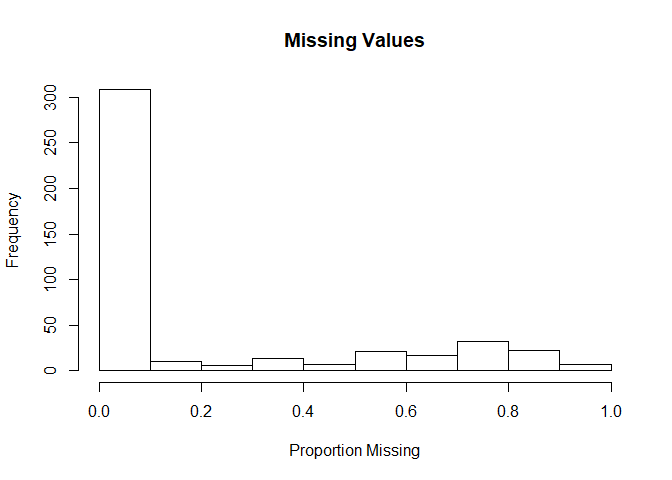
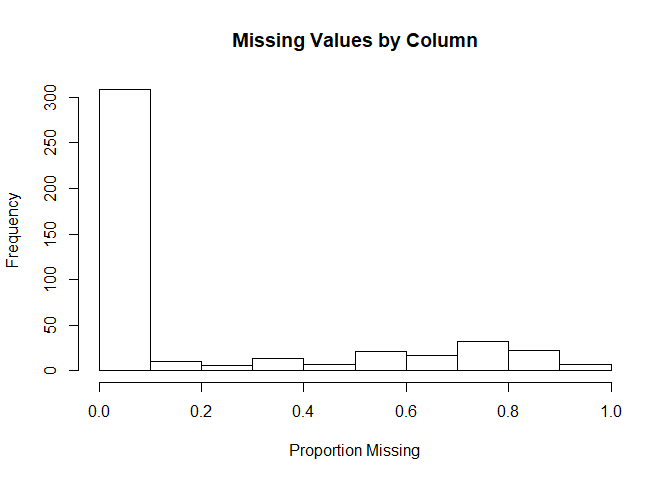
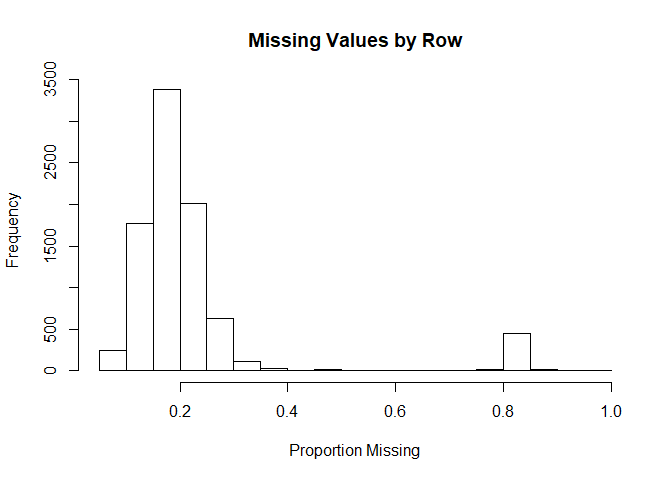
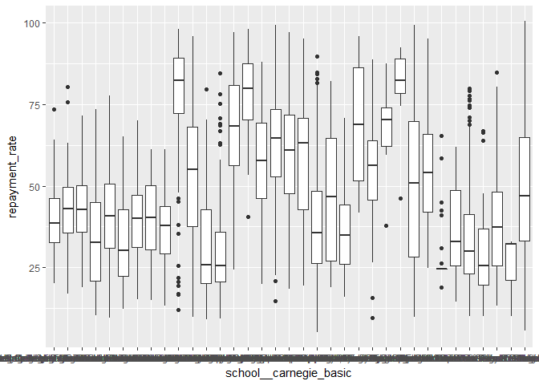
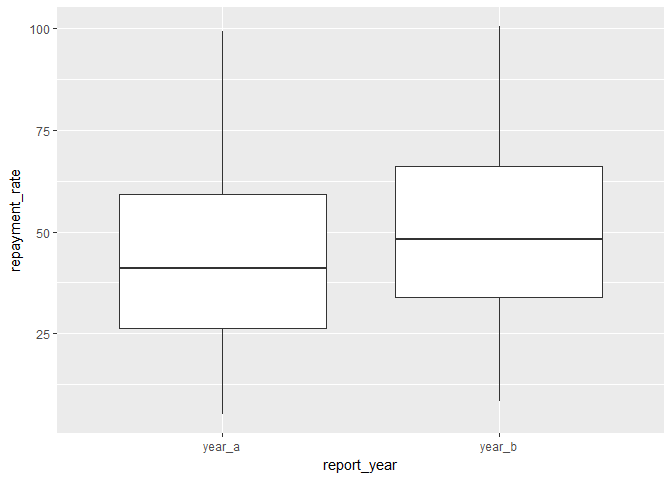
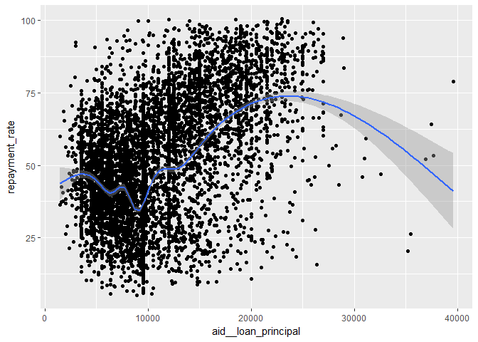
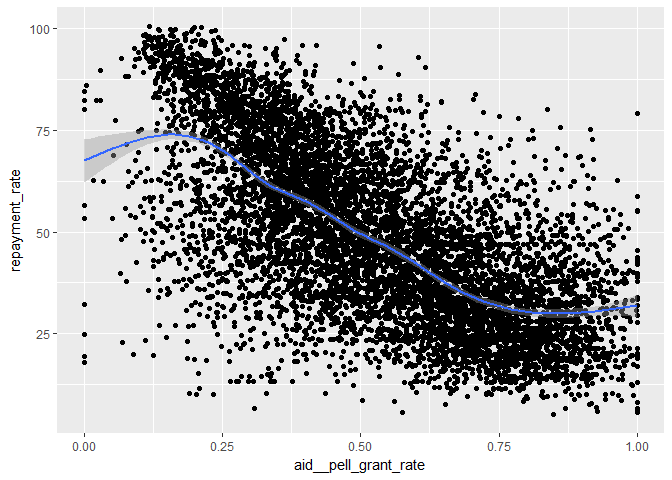
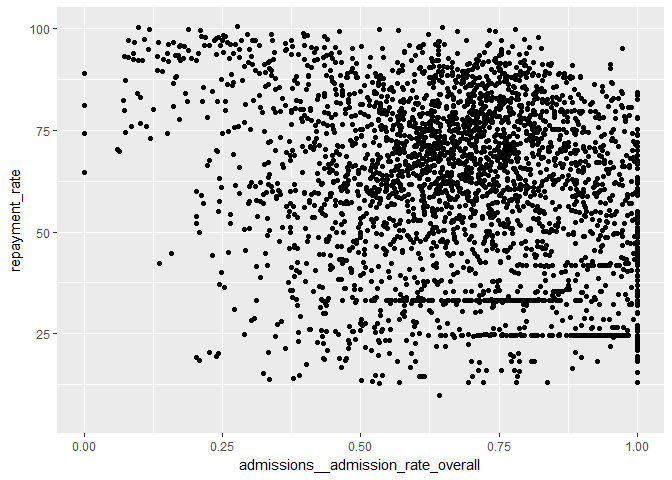
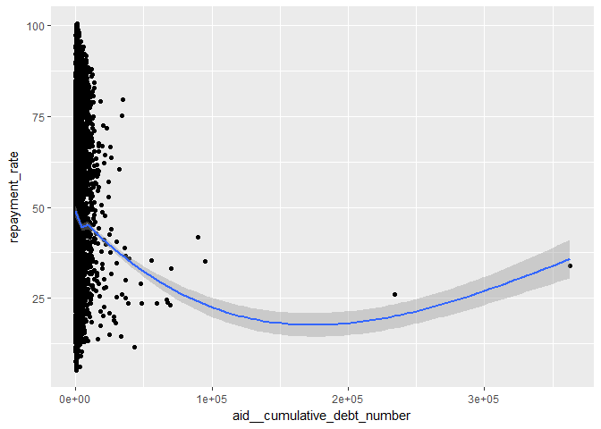
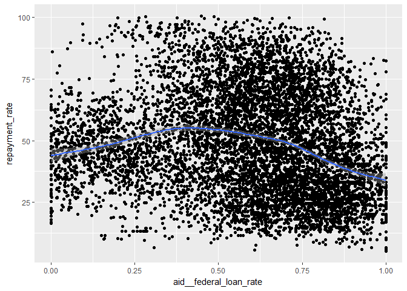

Exploratory Data Analysis for Modeling
================
Mark Blackmore
2017-11-29

-   [Read Pre-Processed Data](#read-pre-processed-data)
-   [Missing Data](#missing-data)
-   [Look for Potential Explanatory Variables](#look-for-potential-explanatory-variables)
-   [Session info](#session-info)

Read Pre-Processed Data
-----------------------

``` r
train <- readRDS("./data_processed/train")
test  <- readRDS("./data_processed/test")
```

Missing Data
------------

``` r
missingTrain <- apply(train, 2, function(x) sum(is.na(x)/length(x)))
hist(missingTrain, main = "Missing Values", xlab = "Proportion Missing")
```



Missing Values fraction by column

``` r
missCol <- apply(train, 2, function(x) sum(is.na(x)/length(x)))  
missRow <- apply(train, 1, function(x) sum(is.na(x)/length(x))) 
```

Distribution of Missing Values

``` r
hist(missCol, main = "Missing Values by Column", xlab = "Proportion Missing")
```



``` r
hist(missRow, main = "Missing Values by Row", xlab = "Proportion Missing")
```



Look for Potential Explanatory Variables
----------------------------------------

Carnegie Basic vs. Repayment Rate

``` r
train %>% group_by(school__carnegie_basic) %>% 
  summarise(med = median(repayment_rate)) %>% arrange(med)
```

    ## # A tibble: 35 x 2
    ##                                                         school__carnegie_basic
    ##                                                                          <chr>
    ##  1                   Special Focus Four-Year: Other Technology-Related Schools
    ##  2                                        Special Focus Two-Year: Other Fields
    ##  3         Baccalaureate/Associate's Colleges: Mixed Baccalaureate/Associate's
    ##  4                    Baccalaureate/Associate's Colleges: Associate's Dominant
    ##  5                                  Special Focus Two-Year: Health Professions
    ##  6 Associate's Colleges: High Vocational & Technical-Mixed Traditional/Nontrad
    ##  7                                                             Tribal Colleges
    ##  8       Associate's Colleges: High Vocational & Technical-High Nontraditional
    ##  9                                       Special Focus Two-Year: Arts & Design
    ## 10                      Special Focus Four-Year: Business & Management Schools
    ## # ... with 25 more rows, and 1 more variables: med <dbl>

``` r
ggplot(data = train, aes(x = school__carnegie_basic, 
                         y = repayment_rate)) + geom_boxplot()
```



Report Year vs. Repayment Rate

``` r
train %>% group_by(report_year) %>% 
  summarise(med = median(repayment_rate)) %>% arrange(med)
```

    ## # A tibble: 2 x 2
    ##   report_year      med
    ##         <chr>    <dbl>
    ## 1      year_a 41.08438
    ## 2      year_b 48.08168

``` r
ggplot(data = train, aes(x = report_year, 
                         y = repayment_rate)) + geom_boxplot()
```



EDA - Relevant

``` r
ggplot(data = train, aes(x = aid__loan_principal, 
                         y = repayment_rate)) + geom_point() + geom_smooth() 
```

    ## `geom_smooth()` using method = 'gam'

    ## Warning: Removed 34 rows containing non-finite values (stat_smooth).

    ## Warning: Removed 34 rows containing missing values (geom_point).



``` r
ggplot(data = train, aes(x = aid__pell_grant_rate, 
                         y = repayment_rate)) + geom_point() + geom_smooth() 
```

    ## `geom_smooth()` using method = 'gam'

    ## Warning: Removed 576 rows containing non-finite values (stat_smooth).

    ## Warning: Removed 576 rows containing missing values (geom_point).



More EDA - Noise

``` r
ggplot(data = train, aes(x = admissions__admission_rate_overall, 
                         y = repayment_rate)) + geom_point() 
```

    ## Warning: Removed 5682 rows containing missing values (geom_point).



``` r
ggplot(data = train, aes(x = aid__cumulative_debt_number, 
                         y = repayment_rate)) + geom_point() + geom_smooth()
```

    ## `geom_smooth()` using method = 'gam'

    ## Warning: Removed 14 rows containing non-finite values (stat_smooth).

    ## Warning: Removed 14 rows containing missing values (geom_point).



``` r
ggplot(data = train, aes(x = aid__federal_loan_rate, 
                         y = repayment_rate)) + geom_point() + geom_smooth()
```

    ## `geom_smooth()` using method = 'gam'

    ## Warning: Removed 576 rows containing non-finite values (stat_smooth).

    ## Warning: Removed 576 rows containing missing values (geom_point).



``` r
ggplot(data = train, aes(x = admissions__admission_rate_overall, 
                         y = repayment_rate)) + geom_point() 
```

    ## Warning: Removed 5682 rows containing missing values (geom_point).


------------------------------------------------------------------------

Session info
------------

``` r
sessionInfo()
```

    ## R version 3.4.2 (2017-09-28)
    ## Platform: x86_64-w64-mingw32/x64 (64-bit)
    ## Running under: Windows 10 x64 (build 15063)
    ## 
    ## Matrix products: default
    ## 
    ## locale:
    ## [1] LC_COLLATE=English_United States.1252 
    ## [2] LC_CTYPE=English_United States.1252   
    ## [3] LC_MONETARY=English_United States.1252
    ## [4] LC_NUMERIC=C                          
    ## [5] LC_TIME=English_United States.1252    
    ## 
    ## attached base packages:
    ## [1] grid      stats     graphics  grDevices utils     datasets  methods  
    ## [8] base     
    ## 
    ## other attached packages:
    ##  [1] bindrcpp_0.2        VIM_4.7.0           data.table_1.10.4-2
    ##  [4] colorspace_1.3-2    ranger_0.8.0        glmnet_2.0-13      
    ##  [7] foreach_1.4.3       Matrix_1.2-11       caret_6.0-77       
    ## [10] lattice_0.20-35     dplyr_0.7.4         purrr_0.2.3        
    ## [13] readr_1.1.1         tidyr_0.7.1         tibble_1.3.4       
    ## [16] ggplot2_2.2.1       tidyverse_1.1.1    
    ## 
    ## loaded via a namespace (and not attached):
    ##  [1] nlme_3.1-131       pbkrtest_0.4-7     lubridate_1.6.0   
    ##  [4] dimRed_0.1.0       httr_1.3.1         rprojroot_1.2     
    ##  [7] tools_3.4.2        backports_1.1.1    R6_2.2.2          
    ## [10] rpart_4.1-11       mgcv_1.8-20        lazyeval_0.2.0    
    ## [13] nnet_7.3-12        withr_2.1.0        sp_1.2-5          
    ## [16] tidyselect_0.2.2   mnormt_1.5-5       compiler_3.4.2    
    ## [19] quantreg_5.34      rvest_0.3.2        SparseM_1.77      
    ## [22] xml2_1.1.1         labeling_0.3       scales_0.5.0      
    ## [25] sfsmisc_1.1-1      lmtest_0.9-35      DEoptimR_1.0-8    
    ## [28] psych_1.7.8        robustbase_0.92-8  stringr_1.2.0     
    ## [31] digest_0.6.12      foreign_0.8-69     minqa_1.2.4       
    ## [34] rmarkdown_1.6      pkgconfig_2.0.1    htmltools_0.3.6   
    ## [37] lme4_1.1-14        rlang_0.1.2        readxl_1.0.0      
    ## [40] ddalpha_1.3.1      bindr_0.1          zoo_1.8-0         
    ## [43] jsonlite_1.5       ModelMetrics_1.1.0 car_2.1-6         
    ## [46] magrittr_1.5       Rcpp_0.12.13       munsell_0.4.3     
    ## [49] stringi_1.1.5      yaml_2.1.14        MASS_7.3-47       
    ## [52] plyr_1.8.4         recipes_0.1.1      parallel_3.4.2    
    ## [55] forcats_0.2.0      haven_1.1.0        splines_3.4.2     
    ## [58] hms_0.3            knitr_1.17         boot_1.3-20       
    ## [61] reshape2_1.4.2     codetools_0.2-15   stats4_3.4.2      
    ## [64] CVST_0.2-1         glue_1.1.1         evaluate_0.10.1   
    ## [67] laeken_0.4.6       modelr_0.1.1       vcd_1.4-3         
    ## [70] nloptr_1.0.4       MatrixModels_0.4-1 cellranger_1.1.0  
    ## [73] gtable_0.2.0       kernlab_0.9-25     assertthat_0.2.0  
    ## [76] DRR_0.0.2          gower_0.1.2        prodlim_1.6.1     
    ## [79] broom_0.4.2        e1071_1.6-8        class_7.3-14      
    ## [82] survival_2.41-3    timeDate_3042.101  RcppRoll_0.2.2    
    ## [85] iterators_1.0.8    lava_1.5.1         ipred_0.9-6
