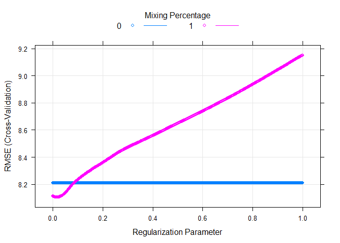

Modeling: Submission One
================
Mark Blackmore
2017-11-29

-   [Read Pre-Processed Data](#read-pre-processed-data)
-   [GLMNET Model, All Predictors](#glmnet-model-all-predictors)
-   [Session info](#session-info)

Read Pre-Processed Data
-----------------------

``` r
train <- readRDS("./data_processed/train")
test  <- readRDS("./data_processed/test")
```

GLMNET Model, All Predictors
----------------------------

Automated Selection, Using Zach Meyer suggestions for baseline

``` r
modNet = train(repayment_rate~., data = train, method = "glmnet",
                preProcess = c("nzv", "medianImpute", "center", "scale"),
                tuneGrid = expand.grid(alpha = 0:1, lambda = seq(.0001, 1, length = 1000)),
                trControl = trainControl(method = "cv", number = 10, verboseIter = TRUE),
                na.action = na.pass)
```

    ## + Fold01: alpha=0, lambda=1 
    ## - Fold01: alpha=0, lambda=1 
    ## + Fold01: alpha=1, lambda=1 
    ## - Fold01: alpha=1, lambda=1 
    ## + Fold02: alpha=0, lambda=1 
    ## - Fold02: alpha=0, lambda=1 
    ## + Fold02: alpha=1, lambda=1 
    ## - Fold02: alpha=1, lambda=1 
    ## + Fold03: alpha=0, lambda=1 
    ## - Fold03: alpha=0, lambda=1 
    ## + Fold03: alpha=1, lambda=1 
    ## - Fold03: alpha=1, lambda=1 
    ## + Fold04: alpha=0, lambda=1 
    ## - Fold04: alpha=0, lambda=1 
    ## + Fold04: alpha=1, lambda=1 
    ## - Fold04: alpha=1, lambda=1 
    ## + Fold05: alpha=0, lambda=1 
    ## - Fold05: alpha=0, lambda=1 
    ## + Fold05: alpha=1, lambda=1 
    ## - Fold05: alpha=1, lambda=1 
    ## + Fold06: alpha=0, lambda=1 
    ## - Fold06: alpha=0, lambda=1 
    ## + Fold06: alpha=1, lambda=1 
    ## - Fold06: alpha=1, lambda=1 
    ## + Fold07: alpha=0, lambda=1 
    ## - Fold07: alpha=0, lambda=1 
    ## + Fold07: alpha=1, lambda=1 
    ## - Fold07: alpha=1, lambda=1 
    ## + Fold08: alpha=0, lambda=1 
    ## - Fold08: alpha=0, lambda=1 
    ## + Fold08: alpha=1, lambda=1 
    ## - Fold08: alpha=1, lambda=1 
    ## + Fold09: alpha=0, lambda=1 
    ## - Fold09: alpha=0, lambda=1 
    ## + Fold09: alpha=1, lambda=1 
    ## - Fold09: alpha=1, lambda=1 
    ## + Fold10: alpha=0, lambda=1 
    ## - Fold10: alpha=0, lambda=1 
    ## + Fold10: alpha=1, lambda=1 
    ## - Fold10: alpha=1, lambda=1 
    ## Aggregating results
    ## Selecting tuning parameters
    ## Fitting alpha = 1, lambda = 0.0201 on full training set

``` r
plot(modNet)
```



``` r
getTrainPerf(modNet)  # Submitted as L1out
```

    ##   TrainRMSE TrainRsquared TrainMAE method
    ## 1  8.104745     0.8509465 6.104002 glmnet

Create Submission

``` r
# modNetout <- predict(modNet, test, na.action = na.pass)
# L1out <- outformat
# L1out$repayment_rate <- modNetout
# head(L1out)
# write.csv(L1out, file = "L1out.csv", row.names = FALSE)
```

------------------------------------------------------------------------

Session info
------------

``` r
sessionInfo()
```

    ## R version 3.4.2 (2017-09-28)
    ## Platform: x86_64-w64-mingw32/x64 (64-bit)
    ## Running under: Windows 10 x64 (build 15063)
    ## 
    ## Matrix products: default
    ## 
    ## locale:
    ## [1] LC_COLLATE=English_United States.1252 
    ## [2] LC_CTYPE=English_United States.1252   
    ## [3] LC_MONETARY=English_United States.1252
    ## [4] LC_NUMERIC=C                          
    ## [5] LC_TIME=English_United States.1252    
    ## 
    ## attached base packages:
    ## [1] grid      stats     graphics  grDevices utils     datasets  methods  
    ## [8] base     
    ## 
    ## other attached packages:
    ##  [1] VIM_4.7.0           data.table_1.10.4-2 colorspace_1.3-2   
    ##  [4] ranger_0.8.0        glmnet_2.0-13       foreach_1.4.3      
    ##  [7] Matrix_1.2-11       caret_6.0-77        lattice_0.20-35    
    ## [10] dplyr_0.7.4         purrr_0.2.3         readr_1.1.1        
    ## [13] tidyr_0.7.1         tibble_1.3.4        ggplot2_2.2.1      
    ## [16] tidyverse_1.1.1    
    ## 
    ## loaded via a namespace (and not attached):
    ##  [1] nlme_3.1-131       pbkrtest_0.4-7     lubridate_1.6.0   
    ##  [4] dimRed_0.1.0       httr_1.3.1         rprojroot_1.2     
    ##  [7] tools_3.4.2        backports_1.1.1    R6_2.2.2          
    ## [10] rpart_4.1-11       mgcv_1.8-20        lazyeval_0.2.0    
    ## [13] nnet_7.3-12        withr_2.1.0        sp_1.2-5          
    ## [16] tidyselect_0.2.2   mnormt_1.5-5       compiler_3.4.2    
    ## [19] quantreg_5.34      rvest_0.3.2        SparseM_1.77      
    ## [22] xml2_1.1.1         scales_0.5.0       sfsmisc_1.1-1     
    ## [25] lmtest_0.9-35      DEoptimR_1.0-8     psych_1.7.8       
    ## [28] robustbase_0.92-8  stringr_1.2.0      digest_0.6.12     
    ## [31] foreign_0.8-69     minqa_1.2.4        rmarkdown_1.6     
    ## [34] pkgconfig_2.0.1    htmltools_0.3.6    lme4_1.1-14       
    ## [37] rlang_0.1.2        readxl_1.0.0       ddalpha_1.3.1     
    ## [40] bindr_0.1          zoo_1.8-0          jsonlite_1.5      
    ## [43] ModelMetrics_1.1.0 car_2.1-6          magrittr_1.5      
    ## [46] Rcpp_0.12.13       munsell_0.4.3      stringi_1.1.5     
    ## [49] yaml_2.1.14        MASS_7.3-47        plyr_1.8.4        
    ## [52] recipes_0.1.1      parallel_3.4.2     forcats_0.2.0     
    ## [55] haven_1.1.0        splines_3.4.2      hms_0.3           
    ## [58] knitr_1.17         boot_1.3-20        reshape2_1.4.2    
    ## [61] codetools_0.2-15   stats4_3.4.2       CVST_0.2-1        
    ## [64] glue_1.1.1         evaluate_0.10.1    laeken_0.4.6      
    ## [67] modelr_0.1.1       vcd_1.4-3          nloptr_1.0.4      
    ## [70] MatrixModels_0.4-1 cellranger_1.1.0   gtable_0.2.0      
    ## [73] kernlab_0.9-25     assertthat_0.2.0   DRR_0.0.2         
    ## [76] gower_0.1.2        prodlim_1.6.1      broom_0.4.2       
    ## [79] e1071_1.6-8        class_7.3-14       survival_2.41-3   
    ## [82] timeDate_3042.101  RcppRoll_0.2.2     iterators_1.0.8   
    ## [85] bindrcpp_0.2       lava_1.5.1         ipred_0.9-6
