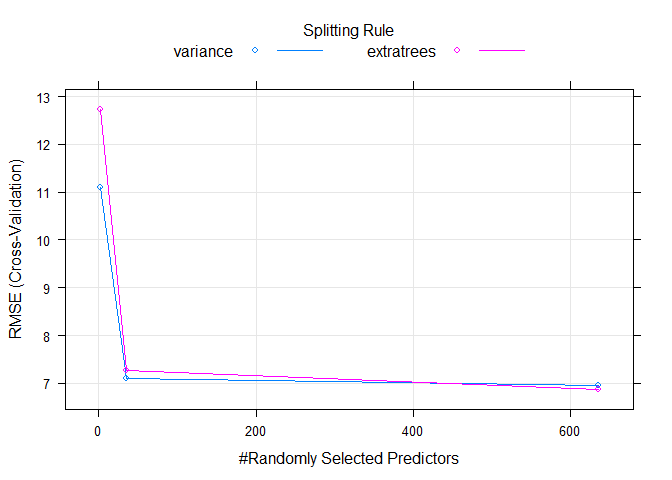

Modeling: Submission Two
================
Mark Blackmore
2017-11-29

-   [Read Pre-Processed Data](#read-pre-processed-data)
-   [Ranger model](#ranger-model)

Read Pre-Processed Data
-----------------------

``` r
train <- readRDS("./data_processed/train")
test  <- readRDS("./data_processed/test")
```

Ranger model
------------

``` r
set.seed(1010)
modelranger <- train(repayment_rate~.,
  data = train, method = "ranger",
  preProcess = c("medianImpute"),
  #tuneGrid = data.frame(mtry = seq(180, 270, length = 10)),
  na.action = na.pass,
  trControl = trainControl(method = "cv", number = 10, verboseIter = TRUE))
```

    ## + Fold01: mtry=  2, splitrule=variance 
    ## - Fold01: mtry=  2, splitrule=variance 
    ## + Fold01: mtry= 35, splitrule=variance 
    ## - Fold01: mtry= 35, splitrule=variance 
    ## + Fold01: mtry=635, splitrule=variance 
    ## Growing trees.. Progress: 6%. Estimated remaining time: 8 minutes, 55 seconds.
    ## Growing trees.. Progress: 12%. Estimated remaining time: 7 minutes, 40 seconds.
    ## Growing trees.. Progress: 19%. Estimated remaining time: 6 minutes, 44 seconds.
    ## Growing trees.. Progress: 26%. Estimated remaining time: 6 minutes, 12 seconds.
    ## Growing trees.. Progress: 32%. Estimated remaining time: 5 minutes, 36 seconds.
    ## Growing trees.. Progress: 39%. Estimated remaining time: 4 minutes, 56 seconds.
    ## Growing trees.. Progress: 46%. Estimated remaining time: 4 minutes, 18 seconds.
    ## Growing trees.. Progress: 53%. Estimated remaining time: 3 minutes, 47 seconds.
    ## Growing trees.. Progress: 60%. Estimated remaining time: 3 minutes, 12 seconds.
    ## Growing trees.. Progress: 67%. Estimated remaining time: 2 minutes, 39 seconds.
    ## Growing trees.. Progress: 73%. Estimated remaining time: 2 minutes, 9 seconds.
    ## Growing trees.. Progress: 80%. Estimated remaining time: 1 minute, 36 seconds.
    ## Growing trees.. Progress: 86%. Estimated remaining time: 1 minute, 5 seconds.
    ## Growing trees.. Progress: 93%. Estimated remaining time: 33 seconds.
    ## Growing trees.. Progress: 100%. Estimated remaining time: 1 seconds.
    ## - Fold01: mtry=635, splitrule=variance 
    ## + Fold01: mtry=  2, splitrule=extratrees 
    ## - Fold01: mtry=  2, splitrule=extratrees 
    ## + Fold01: mtry= 35, splitrule=extratrees 
    ## - Fold01: mtry= 35, splitrule=extratrees 
    ## + Fold01: mtry=635, splitrule=extratrees 
    ## Growing trees.. Progress: 8%. Estimated remaining time: 5 minutes, 58 seconds.
    ## Growing trees.. Progress: 17%. Estimated remaining time: 5 minutes, 12 seconds.
    ## Growing trees.. Progress: 26%. Estimated remaining time: 4 minutes, 38 seconds.
    ## Growing trees.. Progress: 35%. Estimated remaining time: 4 minutes, 3 seconds.
    ## Growing trees.. Progress: 43%. Estimated remaining time: 3 minutes, 31 seconds.
    ## Growing trees.. Progress: 52%. Estimated remaining time: 2 minutes, 59 seconds.
    ## Growing trees.. Progress: 60%. Estimated remaining time: 2 minutes, 28 seconds.
    ## Growing trees.. Progress: 69%. Estimated remaining time: 1 minute, 56 seconds.
    ## Growing trees.. Progress: 77%. Estimated remaining time: 1 minute, 24 seconds.
    ## Growing trees.. Progress: 86%. Estimated remaining time: 53 seconds.
    ## Growing trees.. Progress: 94%. Estimated remaining time: 21 seconds.
    ## - Fold01: mtry=635, splitrule=extratrees 
    ## + Fold02: mtry=  2, splitrule=variance 
    ## - Fold02: mtry=  2, splitrule=variance 
    ## + Fold02: mtry= 35, splitrule=variance 
    ## - Fold02: mtry= 35, splitrule=variance 
    ## + Fold02: mtry=635, splitrule=variance 
    ## Growing trees.. Progress: 7%. Estimated remaining time: 8 minutes, 1 seconds.
    ## Growing trees.. Progress: 14%. Estimated remaining time: 6 minutes, 58 seconds.
    ## Growing trees.. Progress: 21%. Estimated remaining time: 6 minutes, 16 seconds.
    ## Growing trees.. Progress: 28%. Estimated remaining time: 5 minutes, 38 seconds.
    ## Growing trees.. Progress: 35%. Estimated remaining time: 5 minutes, 2 seconds.
    ## Growing trees.. Progress: 43%. Estimated remaining time: 4 minutes, 28 seconds.
    ## Growing trees.. Progress: 50%. Estimated remaining time: 3 minutes, 52 seconds.
    ## Growing trees.. Progress: 57%. Estimated remaining time: 3 minutes, 20 seconds.
    ## Growing trees.. Progress: 63%. Estimated remaining time: 2 minutes, 49 seconds.
    ## Growing trees.. Progress: 70%. Estimated remaining time: 2 minutes, 17 seconds.
    ## Growing trees.. Progress: 77%. Estimated remaining time: 1 minute, 45 seconds.
    ## Growing trees.. Progress: 84%. Estimated remaining time: 1 minute, 14 seconds.
    ## Growing trees.. Progress: 91%. Estimated remaining time: 43 seconds.
    ## Growing trees.. Progress: 97%. Estimated remaining time: 13 seconds.
    ## - Fold02: mtry=635, splitrule=variance 
    ## + Fold02: mtry=  2, splitrule=extratrees 
    ## - Fold02: mtry=  2, splitrule=extratrees 
    ## + Fold02: mtry= 35, splitrule=extratrees 
    ## - Fold02: mtry= 35, splitrule=extratrees 
    ## + Fold02: mtry=635, splitrule=extratrees 
    ## Growing trees.. Progress: 7%. Estimated remaining time: 6 minutes, 40 seconds.
    ## Growing trees.. Progress: 15%. Estimated remaining time: 5 minutes, 51 seconds.
    ## Growing trees.. Progress: 23%. Estimated remaining time: 5 minutes, 18 seconds.
    ## Growing trees.. Progress: 31%. Estimated remaining time: 4 minutes, 43 seconds.
    ## Growing trees.. Progress: 39%. Estimated remaining time: 4 minutes, 9 seconds.
    ## Growing trees.. Progress: 47%. Estimated remaining time: 3 minutes, 35 seconds.
    ## Growing trees.. Progress: 54%. Estimated remaining time: 3 minutes, 5 seconds.
    ## Growing trees.. Progress: 61%. Estimated remaining time: 2 minutes, 38 seconds.
    ## Growing trees.. Progress: 69%. Estimated remaining time: 2 minutes, 9 seconds.
    ## Growing trees.. Progress: 75%. Estimated remaining time: 1 minute, 44 seconds.
    ## Growing trees.. Progress: 82%. Estimated remaining time: 1 minute, 19 seconds.
    ## Growing trees.. Progress: 87%. Estimated remaining time: 59 seconds.
    ## Growing trees.. Progress: 93%. Estimated remaining time: 31 seconds.
    ## Growing trees.. Progress: 100%. Estimated remaining time: 1 seconds.
    ## - Fold02: mtry=635, splitrule=extratrees 
    ## + Fold03: mtry=  2, splitrule=variance 
    ## - Fold03: mtry=  2, splitrule=variance 
    ## + Fold03: mtry= 35, splitrule=variance 
    ## Growing trees.. Progress: 83%. Estimated remaining time: 6 seconds.
    ## - Fold03: mtry= 35, splitrule=variance 
    ## + Fold03: mtry=635, splitrule=variance 
    ## Growing trees.. Progress: 5%. Estimated remaining time: 11 minutes, 5 seconds.
    ## Growing trees.. Progress: 11%. Estimated remaining time: 9 minutes, 41 seconds.
    ## Growing trees.. Progress: 16%. Estimated remaining time: 8 minutes, 52 seconds.
    ## Growing trees.. Progress: 22%. Estimated remaining time: 8 minutes, 11 seconds.
    ## Growing trees.. Progress: 27%. Estimated remaining time: 7 minutes, 33 seconds.
    ## Growing trees.. Progress: 33%. Estimated remaining time: 6 minutes, 52 seconds.
    ## Growing trees.. Progress: 39%. Estimated remaining time: 6 minutes, 15 seconds.
    ## Growing trees.. Progress: 44%. Estimated remaining time: 5 minutes, 38 seconds.
    ## Growing trees.. Progress: 50%. Estimated remaining time: 5 minutes, 2 seconds.
    ## Growing trees.. Progress: 55%. Estimated remaining time: 4 minutes, 27 seconds.
    ## Growing trees.. Progress: 61%. Estimated remaining time: 3 minutes, 54 seconds.
    ## Growing trees.. Progress: 67%. Estimated remaining time: 3 minutes, 19 seconds.
    ## Growing trees.. Progress: 72%. Estimated remaining time: 2 minutes, 45 seconds.
    ## Growing trees.. Progress: 78%. Estimated remaining time: 2 minutes, 12 seconds.
    ## Growing trees.. Progress: 83%. Estimated remaining time: 1 minute, 39 seconds.
    ## Growing trees.. Progress: 89%. Estimated remaining time: 1 minute, 5 seconds.
    ## Growing trees.. Progress: 95%. Estimated remaining time: 32 seconds.
    ## - Fold03: mtry=635, splitrule=variance 
    ## + Fold03: mtry=  2, splitrule=extratrees 
    ## - Fold03: mtry=  2, splitrule=extratrees 
    ## + Fold03: mtry= 35, splitrule=extratrees 
    ## - Fold03: mtry= 35, splitrule=extratrees 
    ## + Fold03: mtry=635, splitrule=extratrees 
    ## Growing trees.. Progress: 7%. Estimated remaining time: 7 minutes, 32 seconds.
    ## Growing trees.. Progress: 14%. Estimated remaining time: 6 minutes, 39 seconds.
    ## Growing trees.. Progress: 21%. Estimated remaining time: 6 minutes, 1 seconds.
    ## Growing trees.. Progress: 28%. Estimated remaining time: 5 minutes, 25 seconds.
    ## Growing trees.. Progress: 35%. Estimated remaining time: 4 minutes, 53 seconds.
    ## Growing trees.. Progress: 42%. Estimated remaining time: 4 minutes, 27 seconds.
    ## Growing trees.. Progress: 48%. Estimated remaining time: 4 minutes, 2 seconds.
    ## Growing trees.. Progress: 54%. Estimated remaining time: 3 minutes, 37 seconds.
    ## Growing trees.. Progress: 60%. Estimated remaining time: 3 minutes, 9 seconds.
    ## Growing trees.. Progress: 67%. Estimated remaining time: 2 minutes, 40 seconds.
    ## Growing trees.. Progress: 73%. Estimated remaining time: 2 minutes, 10 seconds.
    ## Growing trees.. Progress: 79%. Estimated remaining time: 1 minute, 41 seconds.
    ## Growing trees.. Progress: 85%. Estimated remaining time: 1 minute, 13 seconds.
    ## Growing trees.. Progress: 92%. Estimated remaining time: 41 seconds.
    ## Growing trees.. Progress: 99%. Estimated remaining time: 6 seconds.
    ## - Fold03: mtry=635, splitrule=extratrees 
    ## + Fold04: mtry=  2, splitrule=variance 
    ## - Fold04: mtry=  2, splitrule=variance 
    ## + Fold04: mtry= 35, splitrule=variance 
    ## Growing trees.. Progress: 84%. Estimated remaining time: 5 seconds.
    ## - Fold04: mtry= 35, splitrule=variance 
    ## + Fold04: mtry=635, splitrule=variance 
    ## Growing trees.. Progress: 5%. Estimated remaining time: 9 minutes, 49 seconds.
    ## Growing trees.. Progress: 11%. Estimated remaining time: 8 minutes, 51 seconds.
    ## Growing trees.. Progress: 16%. Estimated remaining time: 8 minutes, 6 seconds.
    ## Growing trees.. Progress: 22%. Estimated remaining time: 7 minutes, 31 seconds.
    ## Growing trees.. Progress: 27%. Estimated remaining time: 6 minutes, 58 seconds.
    ## Growing trees.. Progress: 33%. Estimated remaining time: 6 minutes, 25 seconds.
    ## Growing trees.. Progress: 39%. Estimated remaining time: 5 minutes, 53 seconds.
    ## Growing trees.. Progress: 44%. Estimated remaining time: 5 minutes, 21 seconds.
    ## Growing trees.. Progress: 50%. Estimated remaining time: 4 minutes, 49 seconds.
    ## Growing trees.. Progress: 55%. Estimated remaining time: 4 minutes, 17 seconds.
    ## Growing trees.. Progress: 61%. Estimated remaining time: 3 minutes, 45 seconds.
    ## Growing trees.. Progress: 67%. Estimated remaining time: 3 minutes, 13 seconds.
    ## Growing trees.. Progress: 72%. Estimated remaining time: 2 minutes, 41 seconds.
    ## Growing trees.. Progress: 77%. Estimated remaining time: 2 minutes, 10 seconds.
    ## Growing trees.. Progress: 83%. Estimated remaining time: 1 minute, 38 seconds.
    ## Growing trees.. Progress: 89%. Estimated remaining time: 1 minute, 5 seconds.
    ## Growing trees.. Progress: 94%. Estimated remaining time: 33 seconds.
    ## Growing trees.. Progress: 100%. Estimated remaining time: 1 seconds.
    ## - Fold04: mtry=635, splitrule=variance 
    ## + Fold04: mtry=  2, splitrule=extratrees 
    ## - Fold04: mtry=  2, splitrule=extratrees 
    ## + Fold04: mtry= 35, splitrule=extratrees 
    ## Growing trees.. Progress: 99%. Estimated remaining time: 0 seconds.
    ## - Fold04: mtry= 35, splitrule=extratrees 
    ## + Fold04: mtry=635, splitrule=extratrees 
    ## Growing trees.. Progress: 6%. Estimated remaining time: 7 minutes, 33 seconds.
    ## Growing trees.. Progress: 13%. Estimated remaining time: 7 minutes, 8 seconds.
    ## Growing trees.. Progress: 20%. Estimated remaining time: 6 minutes, 23 seconds.
    ## Growing trees.. Progress: 27%. Estimated remaining time: 5 minutes, 47 seconds.
    ## Growing trees.. Progress: 34%. Estimated remaining time: 5 minutes, 19 seconds.
    ## Growing trees.. Progress: 40%. Estimated remaining time: 4 minutes, 48 seconds.
    ## Growing trees.. Progress: 47%. Estimated remaining time: 4 minutes, 14 seconds.
    ## Growing trees.. Progress: 53%. Estimated remaining time: 3 minutes, 44 seconds.
    ## Growing trees.. Progress: 60%. Estimated remaining time: 3 minutes, 13 seconds.
    ## Growing trees.. Progress: 66%. Estimated remaining time: 2 minutes, 44 seconds.
    ## Growing trees.. Progress: 72%. Estimated remaining time: 2 minutes, 13 seconds.
    ## Growing trees.. Progress: 77%. Estimated remaining time: 1 minute, 54 seconds.
    ## Growing trees.. Progress: 83%. Estimated remaining time: 1 minute, 27 seconds.
    ## Growing trees.. Progress: 89%. Estimated remaining time: 56 seconds.
    ## Growing trees.. Progress: 95%. Estimated remaining time: 25 seconds.
    ## - Fold04: mtry=635, splitrule=extratrees 
    ## + Fold05: mtry=  2, splitrule=variance 
    ## - Fold05: mtry=  2, splitrule=variance 
    ## + Fold05: mtry= 35, splitrule=variance 
    ## Growing trees.. Progress: 70%. Estimated remaining time: 13 seconds.
    ## - Fold05: mtry= 35, splitrule=variance 
    ## + Fold05: mtry=635, splitrule=variance 
    ## Growing trees.. Progress: 4%. Estimated remaining time: 13 minutes, 18 seconds.
    ## Growing trees.. Progress: 9%. Estimated remaining time: 11 minutes, 37 seconds.
    ## Growing trees.. Progress: 14%. Estimated remaining time: 10 minutes, 43 seconds.
    ## Growing trees.. Progress: 18%. Estimated remaining time: 10 minutes, 23 seconds.
    ## Growing trees.. Progress: 22%. Estimated remaining time: 10 minutes, 6 seconds.
    ## Growing trees.. Progress: 26%. Estimated remaining time: 9 minutes, 40 seconds.
    ## Growing trees.. Progress: 29%. Estimated remaining time: 9 minutes, 27 seconds.
    ## Growing trees.. Progress: 32%. Estimated remaining time: 9 minutes, 17 seconds.
    ## Growing trees.. Progress: 35%. Estimated remaining time: 9 minutes, 5 seconds.
    ## Growing trees.. Progress: 39%. Estimated remaining time: 8 minutes, 49 seconds.
    ## Growing trees.. Progress: 42%. Estimated remaining time: 8 minutes, 29 seconds.
    ## Growing trees.. Progress: 45%. Estimated remaining time: 8 minutes, 7 seconds.
    ## Growing trees.. Progress: 48%. Estimated remaining time: 7 minutes, 39 seconds.
    ## Growing trees.. Progress: 52%. Estimated remaining time: 7 minutes, 13 seconds.
    ## Growing trees.. Progress: 55%. Estimated remaining time: 6 minutes, 40 seconds.
    ## Growing trees.. Progress: 59%. Estimated remaining time: 6 minutes, 1 seconds.
    ## Growing trees.. Progress: 63%. Estimated remaining time: 5 minutes, 20 seconds.
    ## Growing trees.. Progress: 68%. Estimated remaining time: 4 minutes, 31 seconds.
    ## Growing trees.. Progress: 73%. Estimated remaining time: 3 minutes, 52 seconds.
    ## Growing trees.. Progress: 78%. Estimated remaining time: 3 minutes, 6 seconds.
    ## Growing trees.. Progress: 83%. Estimated remaining time: 2 minutes, 18 seconds.
    ## Growing trees.. Progress: 88%. Estimated remaining time: 1 minute, 38 seconds.
    ## Growing trees.. Progress: 93%. Estimated remaining time: 58 seconds.
    ## Growing trees.. Progress: 98%. Estimated remaining time: 19 seconds.
    ## - Fold05: mtry=635, splitrule=variance 
    ## + Fold05: mtry=  2, splitrule=extratrees 
    ## - Fold05: mtry=  2, splitrule=extratrees 
    ## + Fold05: mtry= 35, splitrule=extratrees 
    ## Growing trees.. Progress: 80%. Estimated remaining time: 7 seconds.
    ## - Fold05: mtry= 35, splitrule=extratrees 
    ## + Fold05: mtry=635, splitrule=extratrees 
    ## Growing trees.. Progress: 5%. Estimated remaining time: 9 minutes, 49 seconds.
    ## Growing trees.. Progress: 10%. Estimated remaining time: 9 minutes, 18 seconds.
    ## Growing trees.. Progress: 16%. Estimated remaining time: 8 minutes, 16 seconds.
    ## Growing trees.. Progress: 22%. Estimated remaining time: 7 minutes, 19 seconds.
    ## Growing trees.. Progress: 28%. Estimated remaining time: 6 minutes, 47 seconds.
    ## Growing trees.. Progress: 35%. Estimated remaining time: 6 minutes, 4 seconds.
    ## Growing trees.. Progress: 41%. Estimated remaining time: 5 minutes, 25 seconds.
    ## Growing trees.. Progress: 47%. Estimated remaining time: 4 minutes, 49 seconds.
    ## Growing trees.. Progress: 53%. Estimated remaining time: 4 minutes, 16 seconds.
    ## Growing trees.. Progress: 59%. Estimated remaining time: 3 minutes, 40 seconds.
    ## Growing trees.. Progress: 65%. Estimated remaining time: 3 minutes, 12 seconds.
    ## Growing trees.. Progress: 71%. Estimated remaining time: 2 minutes, 40 seconds.
    ## Growing trees.. Progress: 77%. Estimated remaining time: 2 minutes, 7 seconds.
    ## Growing trees.. Progress: 83%. Estimated remaining time: 1 minute, 34 seconds.
    ## Growing trees.. Progress: 88%. Estimated remaining time: 1 minute, 4 seconds.
    ## Growing trees.. Progress: 94%. Estimated remaining time: 32 seconds.
    ## Growing trees.. Progress: 100%. Estimated remaining time: 1 seconds.
    ## - Fold05: mtry=635, splitrule=extratrees 
    ## + Fold06: mtry=  2, splitrule=variance 
    ## - Fold06: mtry=  2, splitrule=variance 
    ## + Fold06: mtry= 35, splitrule=variance 
    ## Growing trees.. Progress: 78%. Estimated remaining time: 8 seconds.
    ## - Fold06: mtry= 35, splitrule=variance 
    ## + Fold06: mtry=635, splitrule=variance 
    ## Growing trees.. Progress: 5%. Estimated remaining time: 11 minutes, 5 seconds.
    ## Growing trees.. Progress: 10%. Estimated remaining time: 9 minutes, 28 seconds.
    ## Growing trees.. Progress: 15%. Estimated remaining time: 9 minutes, 3 seconds.
    ## Growing trees.. Progress: 20%. Estimated remaining time: 8 minutes, 31 seconds.
    ## Growing trees.. Progress: 25%. Estimated remaining time: 7 minutes, 55 seconds.
    ## Growing trees.. Progress: 30%. Estimated remaining time: 7 minutes, 26 seconds.
    ## Growing trees.. Progress: 35%. Estimated remaining time: 6 minutes, 57 seconds.
    ## Growing trees.. Progress: 40%. Estimated remaining time: 6 minutes, 24 seconds.
    ## Growing trees.. Progress: 44%. Estimated remaining time: 5 minutes, 59 seconds.
    ## Growing trees.. Progress: 49%. Estimated remaining time: 5 minutes, 29 seconds.
    ## Growing trees.. Progress: 54%. Estimated remaining time: 4 minutes, 58 seconds.
    ## Growing trees.. Progress: 59%. Estimated remaining time: 4 minutes, 29 seconds.
    ## Growing trees.. Progress: 64%. Estimated remaining time: 3 minutes, 55 seconds.
    ## Growing trees.. Progress: 69%. Estimated remaining time: 3 minutes, 21 seconds.
    ## Growing trees.. Progress: 75%. Estimated remaining time: 2 minutes, 43 seconds.
    ## Growing trees.. Progress: 80%. Estimated remaining time: 2 minutes, 6 seconds.
    ## Growing trees.. Progress: 86%. Estimated remaining time: 1 minute, 30 seconds.
    ## Growing trees.. Progress: 91%. Estimated remaining time: 1 minute, 0 seconds.
    ## Growing trees.. Progress: 95%. Estimated remaining time: 29 seconds.
    ## Growing trees.. Progress: 100%. Estimated remaining time: 0 seconds.
    ## - Fold06: mtry=635, splitrule=variance 
    ## + Fold06: mtry=  2, splitrule=extratrees 
    ## - Fold06: mtry=  2, splitrule=extratrees 
    ## + Fold06: mtry= 35, splitrule=extratrees 
    ## Growing trees.. Progress: 98%. Estimated remaining time: 0 seconds.
    ## - Fold06: mtry= 35, splitrule=extratrees 
    ## + Fold06: mtry=635, splitrule=extratrees 
    ## Growing trees.. Progress: 6%. Estimated remaining time: 8 minutes, 55 seconds.
    ## Growing trees.. Progress: 11%. Estimated remaining time: 8 minutes, 32 seconds.
    ## Growing trees.. Progress: 17%. Estimated remaining time: 7 minutes, 58 seconds.
    ## Growing trees.. Progress: 23%. Estimated remaining time: 7 minutes, 28 seconds.
    ## Growing trees.. Progress: 28%. Estimated remaining time: 7 minutes, 0 seconds.
    ## Growing trees.. Progress: 33%. Estimated remaining time: 6 minutes, 33 seconds.
    ## Growing trees.. Progress: 38%. Estimated remaining time: 6 minutes, 0 seconds.
    ## Growing trees.. Progress: 43%. Estimated remaining time: 5 minutes, 35 seconds.
    ## Growing trees.. Progress: 49%. Estimated remaining time: 5 minutes, 3 seconds.
    ## Growing trees.. Progress: 54%. Estimated remaining time: 4 minutes, 34 seconds.
    ## Growing trees.. Progress: 59%. Estimated remaining time: 4 minutes, 2 seconds.
    ## Growing trees.. Progress: 64%. Estimated remaining time: 3 minutes, 32 seconds.
    ## Growing trees.. Progress: 70%. Estimated remaining time: 2 minutes, 59 seconds.
    ## Growing trees.. Progress: 75%. Estimated remaining time: 2 minutes, 28 seconds.
    ## Growing trees.. Progress: 81%. Estimated remaining time: 1 minute, 55 seconds.
    ## Growing trees.. Progress: 86%. Estimated remaining time: 1 minute, 23 seconds.
    ## Growing trees.. Progress: 92%. Estimated remaining time: 49 seconds.
    ## Growing trees.. Progress: 97%. Estimated remaining time: 17 seconds.
    ## - Fold06: mtry=635, splitrule=extratrees 
    ## + Fold07: mtry=  2, splitrule=variance 
    ## - Fold07: mtry=  2, splitrule=variance 
    ## + Fold07: mtry= 35, splitrule=variance 
    ## Growing trees.. Progress: 76%. Estimated remaining time: 9 seconds.
    ## - Fold07: mtry= 35, splitrule=variance 
    ## + Fold07: mtry=635, splitrule=variance 
    ## Growing trees.. Progress: 4%. Estimated remaining time: 11 minutes, 47 seconds.
    ## Growing trees.. Progress: 9%. Estimated remaining time: 10 minutes, 11 seconds.
    ## Growing trees.. Progress: 15%. Estimated remaining time: 9 minutes, 27 seconds.
    ## Growing trees.. Progress: 19%. Estimated remaining time: 8 minutes, 51 seconds.
    ## Growing trees.. Progress: 24%. Estimated remaining time: 8 minutes, 18 seconds.
    ## Growing trees.. Progress: 29%. Estimated remaining time: 7 minutes, 45 seconds.
    ## Growing trees.. Progress: 35%. Estimated remaining time: 7 minutes, 5 seconds.
    ## Growing trees.. Progress: 40%. Estimated remaining time: 6 minutes, 33 seconds.
    ## Growing trees.. Progress: 45%. Estimated remaining time: 5 minutes, 55 seconds.
    ## Growing trees.. Progress: 50%. Estimated remaining time: 5 minutes, 23 seconds.
    ## Growing trees.. Progress: 55%. Estimated remaining time: 4 minutes, 49 seconds.
    ## Growing trees.. Progress: 60%. Estimated remaining time: 4 minutes, 15 seconds.
    ## Growing trees.. Progress: 65%. Estimated remaining time: 3 minutes, 43 seconds.
    ## Growing trees.. Progress: 70%. Estimated remaining time: 3 minutes, 11 seconds.
    ## Growing trees.. Progress: 75%. Estimated remaining time: 2 minutes, 38 seconds.
    ## Growing trees.. Progress: 80%. Estimated remaining time: 2 minutes, 5 seconds.
    ## Growing trees.. Progress: 85%. Estimated remaining time: 1 minute, 35 seconds.
    ## Growing trees.. Progress: 90%. Estimated remaining time: 1 minute, 4 seconds.
    ## Growing trees.. Progress: 95%. Estimated remaining time: 33 seconds.
    ## Growing trees.. Progress: 100%. Estimated remaining time: 2 seconds.
    ## - Fold07: mtry=635, splitrule=variance 
    ## + Fold07: mtry=  2, splitrule=extratrees 
    ## - Fold07: mtry=  2, splitrule=extratrees 
    ## + Fold07: mtry= 35, splitrule=extratrees 
    ## Growing trees.. Progress: 90%. Estimated remaining time: 3 seconds.
    ## - Fold07: mtry= 35, splitrule=extratrees 
    ## + Fold07: mtry=635, splitrule=extratrees 
    ## Growing trees.. Progress: 6%. Estimated remaining time: 8 minutes, 39 seconds.
    ## Growing trees.. Progress: 12%. Estimated remaining time: 7 minutes, 47 seconds.
    ## Growing trees.. Progress: 19%. Estimated remaining time: 7 minutes, 8 seconds.
    ## Growing trees.. Progress: 25%. Estimated remaining time: 6 minutes, 33 seconds.
    ## Growing trees.. Progress: 31%. Estimated remaining time: 5 minutes, 53 seconds.
    ## Growing trees.. Progress: 38%. Estimated remaining time: 5 minutes, 19 seconds.
    ## Growing trees.. Progress: 44%. Estimated remaining time: 4 minutes, 45 seconds.
    ## Growing trees.. Progress: 50%. Estimated remaining time: 4 minutes, 20 seconds.
    ## Growing trees.. Progress: 56%. Estimated remaining time: 3 minutes, 43 seconds.
    ## Growing trees.. Progress: 63%. Estimated remaining time: 3 minutes, 7 seconds.
    ## Growing trees.. Progress: 70%. Estimated remaining time: 2 minutes, 35 seconds.
    ## Growing trees.. Progress: 76%. Estimated remaining time: 2 minutes, 2 seconds.
    ## Growing trees.. Progress: 82%. Estimated remaining time: 1 minute, 29 seconds.
    ## Growing trees.. Progress: 89%. Estimated remaining time: 56 seconds.
    ## Growing trees.. Progress: 95%. Estimated remaining time: 24 seconds.
    ## - Fold07: mtry=635, splitrule=extratrees 
    ## + Fold08: mtry=  2, splitrule=variance 
    ## - Fold08: mtry=  2, splitrule=variance 
    ## + Fold08: mtry= 35, splitrule=variance 
    ## Growing trees.. Progress: 67%. Estimated remaining time: 15 seconds.
    ## - Fold08: mtry= 35, splitrule=variance 
    ## + Fold08: mtry=635, splitrule=variance 
    ## Growing trees.. Progress: 5%. Estimated remaining time: 10 minutes, 8 seconds.
    ## Growing trees.. Progress: 11%. Estimated remaining time: 8 minutes, 59 seconds.
    ## Growing trees.. Progress: 16%. Estimated remaining time: 8 minutes, 11 seconds.
    ## Growing trees.. Progress: 22%. Estimated remaining time: 7 minutes, 35 seconds.
    ## Growing trees.. Progress: 28%. Estimated remaining time: 6 minutes, 54 seconds.
    ## Growing trees.. Progress: 33%. Estimated remaining time: 6 minutes, 23 seconds.
    ## Growing trees.. Progress: 39%. Estimated remaining time: 5 minutes, 48 seconds.
    ## Growing trees.. Progress: 44%. Estimated remaining time: 5 minutes, 16 seconds.
    ## Growing trees.. Progress: 49%. Estimated remaining time: 4 minutes, 50 seconds.
    ## Growing trees.. Progress: 54%. Estimated remaining time: 4 minutes, 31 seconds.
    ## Growing trees.. Progress: 57%. Estimated remaining time: 4 minutes, 18 seconds.
    ## Growing trees.. Progress: 62%. Estimated remaining time: 3 minutes, 54 seconds.
    ## Growing trees.. Progress: 67%. Estimated remaining time: 3 minutes, 22 seconds.
    ## Growing trees.. Progress: 72%. Estimated remaining time: 2 minutes, 51 seconds.
    ## Growing trees.. Progress: 77%. Estimated remaining time: 2 minutes, 25 seconds.
    ## Growing trees.. Progress: 81%. Estimated remaining time: 1 minute, 56 seconds.
    ## Growing trees.. Progress: 86%. Estimated remaining time: 1 minute, 30 seconds.
    ## Growing trees.. Progress: 90%. Estimated remaining time: 1 minute, 0 seconds.
    ## Growing trees.. Progress: 96%. Estimated remaining time: 26 seconds.
    ## - Fold08: mtry=635, splitrule=variance 
    ## + Fold08: mtry=  2, splitrule=extratrees 
    ## - Fold08: mtry=  2, splitrule=extratrees 
    ## + Fold08: mtry= 35, splitrule=extratrees 
    ## Growing trees.. Progress: 91%. Estimated remaining time: 2 seconds.
    ## - Fold08: mtry= 35, splitrule=extratrees 
    ## + Fold08: mtry=635, splitrule=extratrees 
    ## Growing trees.. Progress: 6%. Estimated remaining time: 8 minutes, 39 seconds.
    ## Growing trees.. Progress: 12%. Estimated remaining time: 7 minutes, 47 seconds.
    ## Growing trees.. Progress: 19%. Estimated remaining time: 7 minutes, 4 seconds.
    ## Growing trees.. Progress: 25%. Estimated remaining time: 6 minutes, 30 seconds.
    ## Growing trees.. Progress: 31%. Estimated remaining time: 6 minutes, 5 seconds.
    ## Growing trees.. Progress: 37%. Estimated remaining time: 5 minutes, 32 seconds.
    ## Growing trees.. Progress: 43%. Estimated remaining time: 4 minutes, 58 seconds.
    ## Growing trees.. Progress: 49%. Estimated remaining time: 4 minutes, 29 seconds.
    ## Growing trees.. Progress: 55%. Estimated remaining time: 3 minutes, 54 seconds.
    ## Growing trees.. Progress: 62%. Estimated remaining time: 3 minutes, 19 seconds.
    ## Growing trees.. Progress: 67%. Estimated remaining time: 2 minutes, 53 seconds.
    ## Growing trees.. Progress: 73%. Estimated remaining time: 2 minutes, 22 seconds.
    ## Growing trees.. Progress: 79%. Estimated remaining time: 1 minute, 51 seconds.
    ## Growing trees.. Progress: 85%. Estimated remaining time: 1 minute, 17 seconds.
    ## Growing trees.. Progress: 92%. Estimated remaining time: 43 seconds.
    ## Growing trees.. Progress: 98%. Estimated remaining time: 9 seconds.
    ## - Fold08: mtry=635, splitrule=extratrees 
    ## + Fold09: mtry=  2, splitrule=variance 
    ## - Fold09: mtry=  2, splitrule=variance 
    ## + Fold09: mtry= 35, splitrule=variance 
    ## Growing trees.. Progress: 76%. Estimated remaining time: 9 seconds.
    ## - Fold09: mtry= 35, splitrule=variance 
    ## + Fold09: mtry=635, splitrule=variance 
    ## Growing trees.. Progress: 5%. Estimated remaining time: 11 minutes, 5 seconds.
    ## Growing trees.. Progress: 10%. Estimated remaining time: 9 minutes, 54 seconds.
    ## Growing trees.. Progress: 15%. Estimated remaining time: 9 minutes, 27 seconds.
    ## Growing trees.. Progress: 19%. Estimated remaining time: 8 minutes, 58 seconds.
    ## Growing trees.. Progress: 24%. Estimated remaining time: 8 minutes, 29 seconds.
    ## Growing trees.. Progress: 29%. Estimated remaining time: 8 minutes, 1 seconds.
    ## Growing trees.. Progress: 33%. Estimated remaining time: 7 minutes, 30 seconds.
    ## Growing trees.. Progress: 38%. Estimated remaining time: 6 minutes, 59 seconds.
    ## Growing trees.. Progress: 43%. Estimated remaining time: 6 minutes, 25 seconds.
    ## Growing trees.. Progress: 47%. Estimated remaining time: 5 minutes, 53 seconds.
    ## Growing trees.. Progress: 52%. Estimated remaining time: 5 minutes, 21 seconds.
    ## Growing trees.. Progress: 57%. Estimated remaining time: 4 minutes, 48 seconds.
    ## Growing trees.. Progress: 62%. Estimated remaining time: 4 minutes, 15 seconds.
    ## Growing trees.. Progress: 67%. Estimated remaining time: 3 minutes, 42 seconds.
    ## Growing trees.. Progress: 72%. Estimated remaining time: 3 minutes, 8 seconds.
    ## Growing trees.. Progress: 77%. Estimated remaining time: 2 minutes, 34 seconds.
    ## Growing trees.. Progress: 82%. Estimated remaining time: 2 minutes, 1 seconds.
    ## Growing trees.. Progress: 87%. Estimated remaining time: 1 minute, 28 seconds.
    ## Growing trees.. Progress: 91%. Estimated remaining time: 57 seconds.
    ## Growing trees.. Progress: 96%. Estimated remaining time: 25 seconds.
    ## - Fold09: mtry=635, splitrule=variance 
    ## + Fold09: mtry=  2, splitrule=extratrees 
    ## - Fold09: mtry=  2, splitrule=extratrees 
    ## + Fold09: mtry= 35, splitrule=extratrees 
    ## Growing trees.. Progress: 89%. Estimated remaining time: 3 seconds.
    ## - Fold09: mtry= 35, splitrule=extratrees 
    ## + Fold09: mtry=635, splitrule=extratrees 
    ## Growing trees.. Progress: 6%. Estimated remaining time: 9 minutes, 12 seconds.
    ## Growing trees.. Progress: 12%. Estimated remaining time: 8 minutes, 9 seconds.
    ## Growing trees.. Progress: 19%. Estimated remaining time: 7 minutes, 22 seconds.
    ## Growing trees.. Progress: 25%. Estimated remaining time: 6 minutes, 39 seconds.
    ## Growing trees.. Progress: 31%. Estimated remaining time: 6 minutes, 2 seconds.
    ## Growing trees.. Progress: 38%. Estimated remaining time: 5 minutes, 27 seconds.
    ## Growing trees.. Progress: 44%. Estimated remaining time: 4 minutes, 52 seconds.
    ## Growing trees.. Progress: 51%. Estimated remaining time: 4 minutes, 17 seconds.
    ## Growing trees.. Progress: 57%. Estimated remaining time: 3 minutes, 44 seconds.
    ## Growing trees.. Progress: 63%. Estimated remaining time: 3 minutes, 9 seconds.
    ## Growing trees.. Progress: 70%. Estimated remaining time: 2 minutes, 37 seconds.
    ## Growing trees.. Progress: 76%. Estimated remaining time: 2 minutes, 7 seconds.
    ## Growing trees.. Progress: 82%. Estimated remaining time: 1 minute, 35 seconds.
    ## Growing trees.. Progress: 88%. Estimated remaining time: 1 minute, 1 seconds.
    ## Growing trees.. Progress: 94%. Estimated remaining time: 31 seconds.
    ## - Fold09: mtry=635, splitrule=extratrees 
    ## + Fold10: mtry=  2, splitrule=variance 
    ## - Fold10: mtry=  2, splitrule=variance 
    ## + Fold10: mtry= 35, splitrule=variance 
    ## Growing trees.. Progress: 73%. Estimated remaining time: 11 seconds.
    ## - Fold10: mtry= 35, splitrule=variance 
    ## + Fold10: mtry=635, splitrule=variance 
    ## Growing trees.. Progress: 5%. Estimated remaining time: 10 minutes, 14 seconds.
    ## Growing trees.. Progress: 10%. Estimated remaining time: 9 minutes, 58 seconds.
    ## Growing trees.. Progress: 15%. Estimated remaining time: 9 minutes, 12 seconds.
    ## Growing trees.. Progress: 20%. Estimated remaining time: 8 minutes, 38 seconds.
    ## Growing trees.. Progress: 25%. Estimated remaining time: 8 minutes, 7 seconds.
    ## Growing trees.. Progress: 30%. Estimated remaining time: 7 minutes, 31 seconds.
    ## Growing trees.. Progress: 35%. Estimated remaining time: 7 minutes, 3 seconds.
    ## Growing trees.. Progress: 40%. Estimated remaining time: 6 minutes, 28 seconds.
    ## Growing trees.. Progress: 45%. Estimated remaining time: 5 minutes, 55 seconds.
    ## Growing trees.. Progress: 49%. Estimated remaining time: 5 minutes, 25 seconds.
    ## Growing trees.. Progress: 54%. Estimated remaining time: 4 minutes, 59 seconds.
    ## Growing trees.. Progress: 59%. Estimated remaining time: 4 minutes, 29 seconds.
    ## Growing trees.. Progress: 63%. Estimated remaining time: 3 minutes, 58 seconds.
    ## Growing trees.. Progress: 68%. Estimated remaining time: 3 minutes, 28 seconds.
    ## Growing trees.. Progress: 73%. Estimated remaining time: 2 minutes, 57 seconds.
    ## Growing trees.. Progress: 78%. Estimated remaining time: 2 minutes, 27 seconds.
    ## Growing trees.. Progress: 82%. Estimated remaining time: 1 minute, 56 seconds.
    ## Growing trees.. Progress: 87%. Estimated remaining time: 1 minute, 24 seconds.
    ## Growing trees.. Progress: 92%. Estimated remaining time: 51 seconds.
    ## Growing trees.. Progress: 97%. Estimated remaining time: 17 seconds.
    ## - Fold10: mtry=635, splitrule=variance 
    ## + Fold10: mtry=  2, splitrule=extratrees 
    ## - Fold10: mtry=  2, splitrule=extratrees 
    ## + Fold10: mtry= 35, splitrule=extratrees 
    ## Growing trees.. Progress: 82%. Estimated remaining time: 6 seconds.
    ## - Fold10: mtry= 35, splitrule=extratrees 
    ## + Fold10: mtry=635, splitrule=extratrees 
    ## Growing trees.. Progress: 6%. Estimated remaining time: 8 minutes, 39 seconds.
    ## Growing trees.. Progress: 12%. Estimated remaining time: 7 minutes, 25 seconds.
    ## Growing trees.. Progress: 19%. Estimated remaining time: 6 minutes, 55 seconds.
    ## Growing trees.. Progress: 25%. Estimated remaining time: 6 minutes, 18 seconds.
    ## Growing trees.. Progress: 31%. Estimated remaining time: 5 minutes, 58 seconds.
    ## Growing trees.. Progress: 37%. Estimated remaining time: 5 minutes, 23 seconds.
    ## Growing trees.. Progress: 43%. Estimated remaining time: 4 minutes, 50 seconds.
    ## Growing trees.. Progress: 50%. Estimated remaining time: 4 minutes, 18 seconds.
    ## Growing trees.. Progress: 55%. Estimated remaining time: 3 minutes, 51 seconds.
    ## Growing trees.. Progress: 61%. Estimated remaining time: 3 minutes, 23 seconds.
    ## Growing trees.. Progress: 67%. Estimated remaining time: 2 minutes, 50 seconds.
    ## Growing trees.. Progress: 73%. Estimated remaining time: 2 minutes, 20 seconds.
    ## Growing trees.. Progress: 79%. Estimated remaining time: 1 minute, 48 seconds.
    ## Growing trees.. Progress: 85%. Estimated remaining time: 1 minute, 18 seconds.
    ## Growing trees.. Progress: 91%. Estimated remaining time: 45 seconds.
    ## Growing trees.. Progress: 97%. Estimated remaining time: 15 seconds.
    ## - Fold10: mtry=635, splitrule=extratrees 
    ## Aggregating results
    ## Selecting tuning parameters
    ## Fitting mtry = 635, splitrule = extratrees on full training set
    ## Growing trees.. Progress: 5%. Estimated remaining time: 10 minutes, 27 seconds.
    ## Growing trees.. Progress: 11%. Estimated remaining time: 9 minutes, 25 seconds.
    ## Growing trees.. Progress: 16%. Estimated remaining time: 8 minutes, 37 seconds.
    ## Growing trees.. Progress: 21%. Estimated remaining time: 8 minutes, 20 seconds.
    ## Growing trees.. Progress: 26%. Estimated remaining time: 7 minutes, 37 seconds.
    ## Growing trees.. Progress: 31%. Estimated remaining time: 7 minutes, 12 seconds.
    ## Growing trees.. Progress: 36%. Estimated remaining time: 6 minutes, 43 seconds.
    ## Growing trees.. Progress: 41%. Estimated remaining time: 6 minutes, 8 seconds.
    ## Growing trees.. Progress: 46%. Estimated remaining time: 5 minutes, 37 seconds.
    ## Growing trees.. Progress: 51%. Estimated remaining time: 5 minutes, 7 seconds.
    ## Growing trees.. Progress: 56%. Estimated remaining time: 4 minutes, 35 seconds.
    ## Growing trees.. Progress: 61%. Estimated remaining time: 4 minutes, 4 seconds.
    ## Growing trees.. Progress: 66%. Estimated remaining time: 3 minutes, 32 seconds.
    ## Growing trees.. Progress: 72%. Estimated remaining time: 2 minutes, 57 seconds.
    ## Growing trees.. Progress: 77%. Estimated remaining time: 2 minutes, 25 seconds.
    ## Growing trees.. Progress: 82%. Estimated remaining time: 1 minute, 52 seconds.
    ## Growing trees.. Progress: 87%. Estimated remaining time: 1 minute, 20 seconds.
    ## Growing trees.. Progress: 92%. Estimated remaining time: 47 seconds.
    ## Growing trees.. Progress: 98%. Estimated remaining time: 15 seconds.

``` r
modelranger
```

    ## Random Forest 
    ## 
    ##   0 samples
    ## 443 predictors
    ## 
    ## Pre-processing: median imputation (635) 
    ## Resampling: Cross-Validated (10 fold) 
    ## Summary of sample sizes: 7836, 7833, 7833, 7836, 7834, 7834, ... 
    ## Resampling results across tuning parameters:
    ## 
    ##   mtry  splitrule   RMSE       Rsquared   MAE      
    ##     2   variance    11.104485  0.7614546   8.770868
    ##     2   extratrees  12.736879  0.7029148  10.307391
    ##    35   variance     7.096965  0.8882091   4.861361
    ##    35   extratrees   7.270400  0.8851684   5.148261
    ##   635   variance     6.947595  0.8910804   4.675522
    ##   635   extratrees   6.867750  0.8943263   4.694266
    ## 
    ## RMSE was used to select the optimal model using  the smallest value.
    ## The final values used for the model were mtry = 635 and splitrule
    ##  = extratrees.

``` r
plot(modelranger)
```



``` r
getTrainPerf(modelranger)
```

    ##   TrainRMSE TrainRsquared TrainMAE method
    ## 1   6.86775     0.8943263 4.694266 ranger

``` r
# modelrangerout <- predict(modelranger, test, na.action = na.pass)
```
